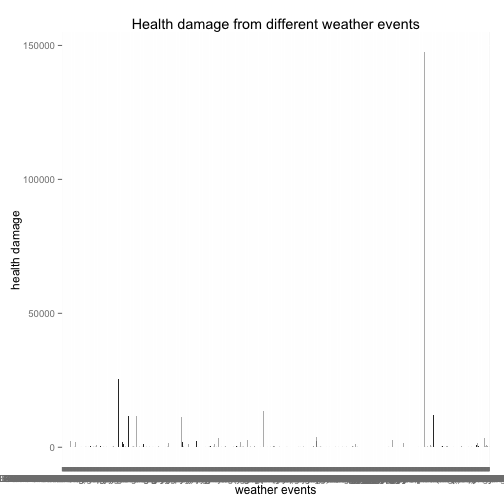
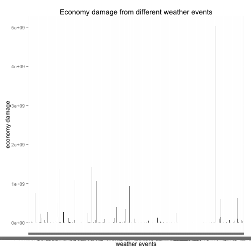

Social-Economic Impacts of Severe Weather Events
========================================================

## Synopsis
In this report we aim to find out that in United States, which types of events are most harmful with respect to population health and which types of events have the greatest economic consequences.Our overall hypothesis is that storms and other severe weather events can cause both public health and economic problems for communities and municipalities. Many severe events can result in fatalities, injuries, and property damage, and preventing such outcomes to the extent possible is a key concern.
To investigate this hypothesis, we obtained data from U.S. National Oceanic and Atmospheric Administration's (NOAA) storm database. 
From these data, we found that, which types of events are most harmful with respect to population health and which types of events have the greatest economic consequences

## Data Processing
### Load Data

```r
library(ggplot2)
## Load data
data <- read.csv("/Users/xiangjiang/Documents/dataset/repdata-data-StormData.csv")
```


### Impacts on Public Health

1.Build the metric for public health
Fatalities and injuries both paly a very important role in public health. However, since fatalities are much more severe than injuries, fatalities will have 10 times weight as injuries.


```r
## Build the metric for public health
health <- data$FATALITIES * 10 + data$INJURIES
df_h <- data.frame(data$EVTYPE, health)
```


2.Compute damage for each weather event
Compute the total health damage from each weather event.

```r
health_damage <- aggregate(df_h$health, by = list(df_h$data.EVTYPE), sum)
```


3.Compare and get the cooresponding event with highest damage
Visualize the data as histogram.

```r
qplot(health_damage$Group.1, health_damage$x, geom = "histogram", xlab = "weather events", 
    ylab = "health damage", main = "Health damage from different weather events")
```

```
## Mapping a variable to y and also using stat="bin".
##   With stat="bin", it will attempt to set the y value to the count of cases in each group.
##   This can result in unexpected behavior and will not be allowed in a future version of ggplot2.
##   If you want y to represent counts of cases, use stat="bin" and don't map a variable to y.
##   If you want y to represent values in the data, use stat="identity".
##   See ?geom_bar for examples. (Deprecated; last used in version 0.9.2)
```

```
## Warning: position_stack requires constant width: output may be incorrect
```

 

The weather with highest damage is:

```r
health_damage$Group.1[which.max(health_damage$x)]
```

```
## [1] TORNADO
## 985 Levels:    HIGH SURF ADVISORY  COASTAL FLOOD ... WND
```


### Impacts on Property
1.Build the metric for property
Property damage and crop damage both paly a very important role in public health. They will have the same weight when computing the total damage for property.


```r
## Data preparation compute real value with scale
data$PROPDMGEXP <- as.character(data$PROPDMGEXP)
data$PROPDMGEXP[data$PROPDMGEXP == "K"] <- 1000
data$PROPDMGEXP[data$PROPDMGEXP == "M"] <- 1e+06
data$PROPDMGEXP[data$PROPDMGEXP == ""] <- 1

data$PROPDMG <- as.numeric(data$PROPDMG)
data$PROPDMGEXP <- as.numeric(data$PROPDMGEXP)
```

```
## Warning: NAs introduced by coercion
```

```r
data$PROPDMG <- data$PROPDMG * data$PROPDMGEXP

data$CROPDMGEXP <- as.character(data$CROPDMGEXP)
data$CROPDMGEXP[data$CROPDMGEXP == "K"] <- 1000
data$CROPDMGEXP[data$CROPDMGEXP == "M"] <- 1e+06
data$CROPDMGEXP[data$CROPDMGEXP == ""] <- 1

data$CROPDMG <- as.numeric(data$CROPDMG)
data$CROPDMGEXP <- as.numeric(data$CROPDMGEXP)
```

```
## Warning: NAs introduced by coercion
```

```r
data$CROPDMG <- data$CROPDMG * data$CROPDMGEXP

## damage for property
economy <- data$CROPDMG + data$PROPDMG
eco_df <- data.frame(data$EVTYPE, economy)
```


2.Compute damage for each weather event
Compute the total economy damage from each weather event.

```r
eco_damage <- aggregate(eco_df$economy, by = list(eco_df$data.EVTYPE), sum)
```


3.Compare and get the cooresponding event with highest damage
Visualize the data as histogram.

```r
qplot(eco_damage$Group.1, eco_damage$x, geom = "histogram", xlab = "weather events", 
    ylab = "economy damage", main = "Economy damage from different weather events")
```

```
## Mapping a variable to y and also using stat="bin".
##   With stat="bin", it will attempt to set the y value to the count of cases in each group.
##   This can result in unexpected behavior and will not be allowed in a future version of ggplot2.
##   If you want y to represent counts of cases, use stat="bin" and don't map a variable to y.
##   If you want y to represent values in the data, use stat="identity".
##   See ?geom_bar for examples. (Deprecated; last used in version 0.9.2)
```

```
## Warning: Removed 33 rows containing missing values (position_stack).
## Warning: position_stack requires constant width: output may be incorrect
```

 

The weather with highest damage is:

```r
eco_damage$Group.1[which.max(eco_damage$x)]
```

```
## [1] TSTM WIND
## 985 Levels:    HIGH SURF ADVISORY  COASTAL FLOOD ... WND
```


## Results
Expetiments indicate that TORNADO is the most harmful with respect to population health and TSTM WIND have the greatest economic consequences.
