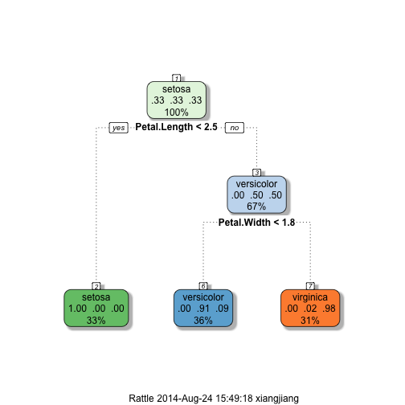

Iris Classification using Decision Tree
========================================================
author: Xiang Jiang
date: Aug 24 2014

Introduction to Dataset
========================================================

The Iris dataset has five variables:

```
[1] "Sepal.Length" "Sepal.Width"  "Petal.Length" "Petal.Width" 
[5] "Species"     
```
The first four variables are used for classification, and the last variable *Species* is the target variable.


Exploratory Data Analysis
========================================================

In the Shiny application, we can visualize the dataset by specifying x and y axis yourself.

 

From exploratory analysis, we find that different species of Iris are separable from the features we have.


Building the Decision Tree
========================================================

We now build the decision tree and visualize the tree as follows.

 


Making Predictions
========================================================
In the Shiny app, user can select values for the four features of the input, and a prediction for the specie will be made and shown in the Predictions panel.

